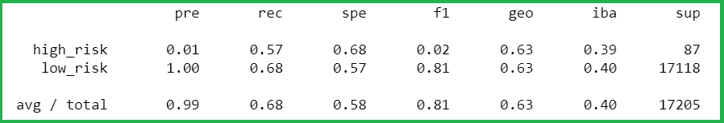
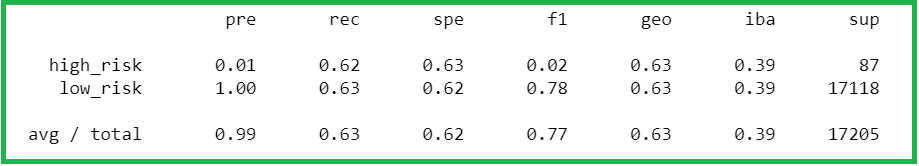
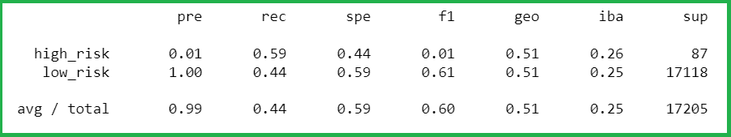
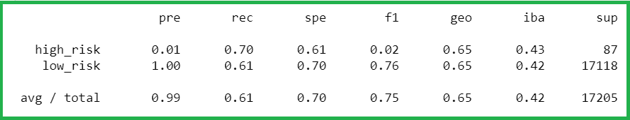
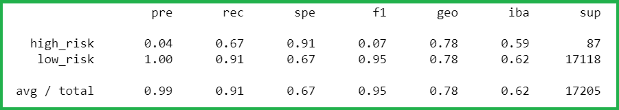
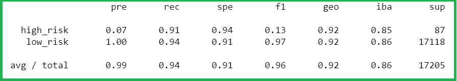

# Credit_Risk_Analysis

## Overview of the project

In this project, we were working on credit card credit data-set. Credit risk is an inherently unbalanced classification
problem, as good loans can easily outnumber risky loans. To make this better, we employed different techniques to train
and evaluate models with unbalanced classes imbalanced-learn and scikit-learn libraries.

## Purpose 

The main purpose of this project was to use oversampling, undersampling and combinatorial approaches of over and
undersampling using the RandomOverSampler, SMOTE, ClusterCentroids and SMOTEENN algorithms. Consequently, we compared
two new machine learning models BalancedRandomForestClassifier and EasyEnsembleClassifier that reduce bias to predict
credit risk.

## Results

**Random Oversampling**

- The balanced accuracy score is 0.629.
- Precision score - Precision score for high risk and low risk are 0.01 and 1.00 respectively.
- Recall score - Recall score for high risk and low risk are 0.57 and 0.68 respectively.

**SMOTE**

- The balanced accuracy score is 0.627.
- Precision score - Precision score for high risk and low risk are 0.01 and 1.00 respectively.
- Recall score - Recall score for high risk and low risk are 0.62 and 0.63 respectively.

**Cluster Centroid Undersampling**

- The balanced accuracy score is 0.510.
- Precision score - Precision score for high risk and low risk are 0.01 and 1.00 respectively.
- Recall score - Recall score for high risk and low risk are 0.59 and 0.44 respectively.

**SMOTEEN**

- The balanced accuracy score is 0.645.
- Precision score - Precision score for high risk and low risk are 0.01 and 1.00 respectively.
- Recall score - Recall score for high risk and low risk are 0.70 and 0.61 respectively.

**Balanced Random Forest Classifier**

- The balanced accuracy score is 0.787.
- Precision score - Precision score for high risk and low risk are 0.04 and 1.00 respectively.
- Recall score - Recall score for high risk and low risk are 0.67 and 0.91 respectively.

**Easy Ensemble AdaBoost Classifier**

- The balanced accuracy score is 0.924.
- Precision score - Precision score for high risk and low risk are 0.07 and 1.00 respectively.
- Recall score - Recall score for high risk and low risk are 0.91 and 0.94 respectively.

## Summary

From the above confusion matrix results, the precision for the high-risk credit as obtained for all the algorithms
is very low. This indicates presence of a large number of false positives, which indicates an unreliable positive
classification. Although the recall scores are relatively better for all the algorithms but, it is not reflecting in
the F1 scores. This shows there is an imbalance between the sensitivity and the precision scores for the models indicating
a below-par model.

The credit risk prediction model is required to have a high precision score so that the number of false positives are lower.
This means that the number of low-risk loans are not classified as high-risk loans. Some of the models above exhibit
higher sensitivities, which means that the number of false negatives is lower for those models but the number of false positives
are higher as seen from lower precision scores. Due to this fact, the F1 scores for these models remain low for prediction of
`high risk` loans. Since the precision for `high risk` loans is not good for any of the above models, none of the above models are recommended to be used for the credit risk prediction.